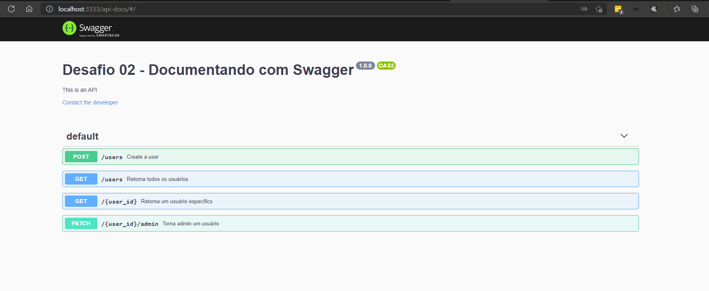

<h1 align="center">🚀 Chapter II - Desafio 1 do Ignite - Trilha NodeJS</h1>
<p align="center">
  Chapter II - Desafio 1: Introdução ao SOLID
  <br>
  
</p>
<h1 align="center">:pushpin: Sobre o desafio</h1>
<p align="left">
  Nesse desafio, foi utilizado um modelo de template que possui o esqueleto do projeto.

  O template pode ser encontrado na seguinte url: **[Acessar Template](https://github.com/rocketseat-education/ignite-template-introducao-ao-SOLID)**

  Dica: Caso não saiba utilizar repositórios do Github como template, utilize o guia em **[nosso FAQ](https://www.notion.so/ddd8fcdf2339436a816a0d9e45767664).**

### :keyboard: Instalação e Execução do Projeto

- Clone este repositório

```
> git clone https://github.com/danielgorgonha/ignite-chapter2-introducao-ao-SOLID
```

- Navegue até o diretório principal do projeto

```
> cd ignite-chapter2-introducao-ao-SOLID
```

- Instale as dependências com o Yarn

```
yarn
```

- Rode a suite de testes

```
yarn test
```

- Execute o projeto

```
yarn dev
```
</p>

<p align="center">
  
</p>

### Documentações com Swagger
## O que foi documentado?

Neste desafio foi documentado as entradas e saídas da API. Abaixo os principais pontos documentado:

- Informações gerais da API (nome, descrição, etc.);
- Rotas;
- Parâmetros;
- Corpo da Requisição;
- Respostas de sucesso;
- Respostas de erro;
- Exemplos;

<p align="center">
  
</p>

## :memo: Licença

Esse projeto está sob a licença MIT. Veja o arquivo [LICENSE](https://github.com/git/git-scm.com/blob/master/MIT-LICENSE.txt) para mais detalhes.

---

Feito com 💜 by <a href="https://www.linkedin.com/in/danielgorgonha/">Daniel R Gorgonha</a> :wave:
